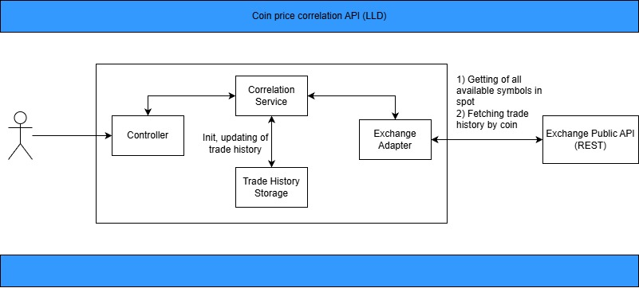

# crypto-analysis-coin-correlation

[](https://github.com/Spayker/crypto-analysis-coin-correlation/actions/workflows/ci.yml) &nbsp;
[](https://github.com/Spayker/crypto-analysis-coin-correlation/blob/main/LICENSE)


Crypto trade coin correlation service provides price change percentage between target coin and other, available on spot market of ByBit.
Typical request:
```GET: http://localhost:8085/v1/BTC/correlations?```
```
    symbols=ALCHUSDT&symbols=FHEUSDT
    &startDateTime=2025-12-01T00:00:00Z
    &endDateTime=2025-12-10T00:00:00Z
    &stableCoin=USDT
```

More information about the API can be found in Medium.

## Architecture


## Technical Stack
1) Java 21
2) SpringBoot 3
3) Feign client
4) resilience4j
5) jackson
6) gson
7) JUnit5
8) GitHub actions

## How To Run
Use next VM options: ```-Dspring.profiles.active=bybit```<br>


## License
GNU 3